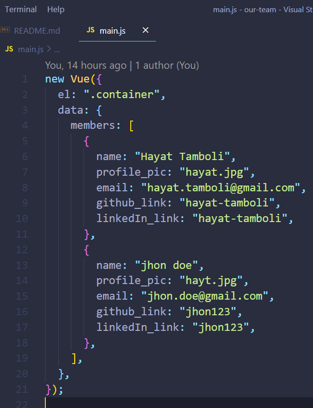

# OUR TEAM WEBSITE

## Fork this repository


Fork this repository by clicking on the fork button on the top of this page.
This will create a copy of this repository in your account.

<hr/>

## Clone the repository


Now clone the forked repository to your machine. Go to your GitHub account, open the forked repository, click on the clone button and then click the *copy to clipboard* icon.

Open a terminal(there is an integrated terminal in VSCODE,better use that) and run the following git command:

```
git clone "url you just copied"
```
where "url you just copied" (without the quotation marks) is the url to this repository (your fork of this project). See the previous steps to obtain the url.


For example:
```
git clone https://github.com/this-is-you/first-contributions.git
```
where `this-is-you` is your GitHub username. Here you're copying the contents of the first-contributions repository on GitHub to your computer.

<hr/>

## Create a branch


Change to the repository directory on your computer (if you are not already there):

```
cd first-contributions
```
Now create a branch using the `git checkout` command:
```
git checkout -b <add-your-new-branch-name>
```

For example:
```
git checkout -b add-my-name
```
<hr/>

## Make necessary changes and commit those changes



Now open `main.js` file in a text editor, add your details in a new object in the members in data. Now, save the file.


If you go to the project directory and execute the command `git status`, you'll see there are changes.


Add those changes to the branch you just created using the `git add` command:

```
git add main.js
```

Now commit those changes using the `git commit` command:
```
git commit -m "Add <your-name> to members data"
```
replacing `<your-name>` with your name.
<hr/>

## Push changes to GitHub

Push your changes using the command `git push`:
```
git push origin <add-your-branch-name>
```
<hr/>

## Submit your changes for review

If you go to your repository on GitHub, you'll see a  `Compare & pull request` button. Click on that button.


Now submit the pull request.


Soon I'll be merging all your changes into the master branch of this project. You will get a notification email once the changes have been merged.

<hr/>

## Where to go from here?

Congrats!  You just completed the standard _fork -> clone -> edit -> PR_ workflow that you'll encounter often as a contributor!

